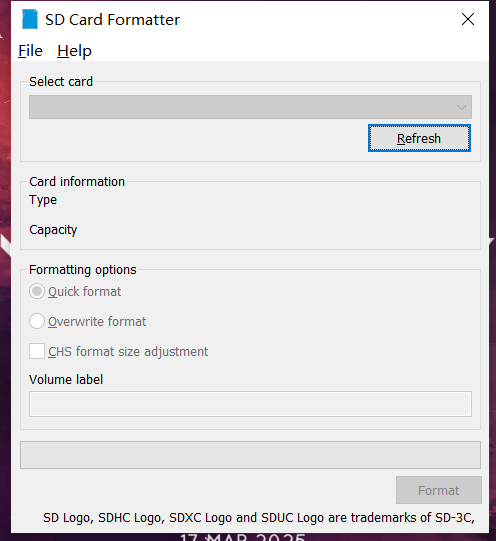

# ROS安装教程
## Ubuntu版本选择和ROS版本选择
作者使用的是树莓派4B来学习ROS，使用Ubuntu版本为20.04，在进行安装工作以前需要准备以下物品：SD卡，读卡器，树莓派镜像烧录工具，SD卡格式化工具。
### SD卡格式化工具（SD card Formatter）
下载链接：https://www.sdcard.org/downloads/formatter/sd-memory-card-formatter-for-windows-download/
### 树莓派镜像烧录工具
下载链接：https://www.raspberrypi.com/software/

## 烧录Ubuntu镜像
1）将下载 Raspberry Pi Imager 安装完成，并将SD卡插入电脑后，进入下面的步骤开始烧录镜像到SD卡中；
2）首先打开SD卡格式化工具，选择插入的SD卡，点击Format按钮。
3）格式化完成后，）打开 Raspberry Pi Imager 并点击选择操作系统，进入后选择 Other general-purpose OS ，然后再选择 Ubuntu ，找到 Ubuntu Server 20.04.5 LTS (64-bit) 并点击此系统即可选中，如下图所示的系统；
4）选择SD卡为刚刚格式化的内存卡；点击“烧录”后，并开始对内存卡中进行内存卡的Ubuntu20.04系统烧写。注意，这个烧写阶段会从Ubuntu官方获取Ubuntu20.04的系统镜像数据，因此需保证在有网的境况下进行操作。大概需要等待4~5分钟。

## 安装ROS
1. 打开命令行，获取官方安装源
    ``` linux
    sudo sh -c 'echo "deb http://packages.ros.org/ros/ubuntu $(lsb_release -sc) main" > /etc/apt/sources.list.d/ros-latest.list'
    ```
2. 设置key
    ``` linux
    sudo apt-key adv --keyserver 'hkp://keyserver.ubuntu.com:80' --recv-key C1CF6E31E6BADE8868B172B4F42ED6FBAB17C654
    ```
3. 更新apt
    ``` linux
    sudo apt update
    ```
4. 安装所需类型的 ROS。
   ROS 有多个类型：Desktop-Full（完整版）、Desktop （桌面版）、ROS-Base（基础版）。其次是ROS版本，ubuntu 20.04 建议安装 noetic 版本。
    ``` linux
    sudo apt install ros-noetic-desktop-full
    ```
5. 安装桌面环境
    依次执行以下命令：
    ``` linux
    sudo apt install ubuntu-desktop
    sudo apt install xrdp
    ```
    安装完后重启：
    ``` linux
    sudo reboot
    ```

6. 配置环境变量
    配置环境变量，方便在任意终端中使用 ROS。
    ``` linux
    echo "source /opt/ros/noetic/setup.bash" >> ~/.bashrc
    source ~/.bashrc
    ```
7. 构建软件包的依赖关系
    到目前为止，已经安装了运行核心ROS软件包所需的软件。要创建和管理你自己的 ROS 工作区，还需要安装其他常用依赖：（如果不是 noetic 版本，就把代码中的所有的3去掉）
    ``` linux
    sudo apt install python3-rosdep python3-rosinstall python3-rosinstall-generator python3-wstool build-essential
    ```
    安装并初始化rosdep。在使用许多ROS工具之前，需要初始化rosdep。rosdep使您可以轻松地为要编译的源安装系统依赖：（如果不是 noetic 版本，就把代码中的3去掉）
    ``` linux
    sudo apt install python3-rosdep
    ``` 
    依次输入以下命令，可以初始化rosdep：
    ``` linux
    sudo rosdep init
    rosdep update
    ``` 

## 测试ROS环境是否配置好
分别启动三个终端，每一个终端输入以下三个指令中的一条指令，最终通过键盘的“↑↓←→”上下左右键来控制小乌龟运动。若环境配置无误，可以看到小乌龟运动和运动轨迹。
```linux
roscore # 启动ros核心
 
rosrun turtlesim turtlesim_node # 启动小乌龟图形化界面
 
rosrun turtlesim turtle_teleop_key # 启动键盘控制节点
```
