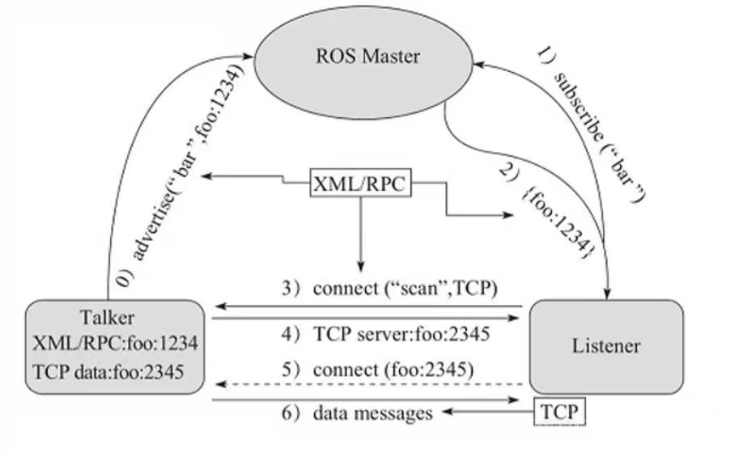

话题通信适用于不断更新数据、少逻辑处理的传输相关的应用场景。
## 话题通讯模型
话题是一种单向通讯方式，它通过发布和订阅的方式传递消息，该模型涉及到三个角色：
``` bash
Master (管理者)
Publisher（发布者）
Subscriber（订阅者）
```
Master 负责保管 Publisher 和 Subscriber 的注册信息，并匹配话题相同的 Publisher 和 Subscriber ，帮助 他们建立连接，连接建立后，Publisher 可以发布消息，且发布的消息会被 Subscriber 订阅。

## 话题模型通讯流程：



### 0）advertise：发布者注册
​ 发布者（Publisher）向管理者（Master）注册信息，包括RPC地址和Topic名字。Master会将发布者的注册信息加入到注册表中，并查询是否有该话题的订阅者。

### 1）subscribe：订阅者注册
​ 订阅者（Subscriber）向管理者（Master）注册信息，包括Topic名字。Master会将订阅者（Subscriber）的注册信息加入到注册表中，并查询是否有该话题的发布者。

### 2）Master匹配信息：牵线搭桥
​ 管理者（Master）通过查询注册表发现有匹配的发布者（Publisher）和订阅者（Subscriber），则向订阅者（Subscriber）发送发布者的RPC地址信息。

### 3）connect：订阅者请求连接发布者
​ 订阅者根据发布者的RPC地址，请求连接发布者（Publisher），并传输订阅的话题名称、消息类型以及通信协议(TCP/UDP)。

### 4）发布者确认请求

发布者（Publisher）收到请求后，通过RPC向订阅者确认连接信息，并发送自身的 TCP/UDP 地址信息。

### 5）建立连接

​ 订阅者根据发布者的TCP/UDP地址信息与订阅者建立TCP/UDP连接。

### 6）发送消息
​ 连接建立后，发布者开始向订阅者发布话题消息数据。

**Note**：
``` bash
上述实现流程中，前五步使用 RPC 协议，最后两步使用 TCP/UDP 协议，默认TCP。
发布者 与 订阅者 的启动无先后顺序要求。
发布者 与 订阅者 都可以有多个。
发布者 与 订阅者 连接建立后，不再需要 ROS Master。即便关闭 ROS Master，发布者 与 订阅者 照常通信。不过不会再有新的发布者 与 订阅者加入。
```

## PRC地址定义
在 ROS 话题通信中，PRC 地址 实际上是 发布者和订阅者之间的通信地址，也就是ROS 节点的网络地址（IP + 端口号）。它在建立节点间通信时用于标识数据流的传输目标。
### 1. PRC 地址的来源
当一个 ROS 节点启动时，它会向 ROS Master 注册，并获取一个可用的 PRC 地址（即本机的 IP + 端口）。这个 PRC 地址用于：
- 监听和接收其他节点的请求（如订阅者请求连接到发布者）。
- 作为发布者，向订阅者提供消息传输的 TCP/UDP 连接。
PRC 地址通常类似于：
    ``` cpp
    http://192.168.1.100:56789/
    ```
    其中：
- 192.168.1.100 → 节点所在的主机 IP 地址
- 56789 → 该节点的监听端口
